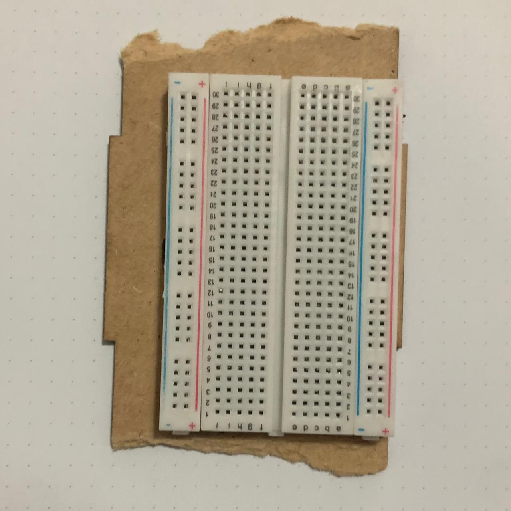

<<<<<<< main
HOLA EN TITULO
==
HOLA EN SUBTITULO
--

LINK DE COMANDOS: https://github.com/adam-p/markdown-here/wiki/Markdown-Cheatsheet





- Arduino UNO R3
- Protoborad
- Cable USB
- Cables Dupont
- Resistencias
- Sensor de color
- Botones y potenciometro

```cpp
// Para encontrar el acento al reves
// Buscar backtick
void setup()
{
int x = 0;
}
```

=======

# índice

- [clase-01](./clase-01)
- [clase-02](./clase-02)
- [clase-03](./clase-03)
- [clase-04](./clase-04)
- [clase-05](./clase-05)
- [clase-06](./clase-06)
- [clase-07](./clase-07)
- [clase-08](./clase-08)
- [clase-09](./clase-09)
- [clase-10](./clase-10)
- [clase-11](./clase-11)
- [clase-12](./clase-12)
  > > > > > > > main


Con el grupo (Tiznado, Viveros y Gonzalez) intentamos de correr el codigo pero no funciono. 

Codigo: 
```cpp
int boton_pin = 2;

int estadoAnterior = LOW;

void setup() 
{
  Serial.begin(9600);

  pinMode(boton_pin, INPUT);
}

void loop() {
  int estadoActual = digitalRead(boton_pin);
  
  if (estadoActual == HIGH && estadoAnterior == LOW) 
  {
    Serial.println("HOLA");
    delay(100);
  }
  estadoAnterior = estadoActual;
}
```


#Codigo Mouse 

Con este codigo podemos apretar un boton y hacer que se mande un mensaje a traves del monitor, en este caso pusimos las palabras "HOLA" y "CHAO" solo para poder comprobar ele efectividad del codigo

```cpp

int boton1 = 2; //Definimos el pin del boton 1 
int boton2 = 4; //Definimos el pin del boton 2
int estadoAntBoton1 = LOW; //Almacenamos el estado inicial del boton 1
int estadoAntBoton2 = LOW; //Almacenamos el estado inicial del boton 2

void setup()
{
  pinMode(boton1, INPUT); //Indicamos que el boton 1 es una entrada
  pinMode(boton2, INPUT); //Indicamos que el boton 2 es una entrada
  Serial.begin(9600); //Iniciamos comunicacion serial 
}

void loop()
{
  int estadoBoton1 = digitalRead(boton1); //Leemos el nuevo estado del boton 1
  int estadoBoton2 = digitalRead(boton2); //Leemos el nuevo estado del boton 2
  
  if(estadoBoton1 == HIGH && estadoAntBoton1 == LOW) //Observamos si cambio el estado del boton 1
  {
    Serial.print("HOLA "); //Mostramos mensaje en el monitor 
    delay(100); //Retardo para leer el mensaje bien
  }
  else if(estadoBoton2 == HIGH && estadoAntBoton2 == LOW)//Observamos si cambio el estado del boton 2
  {
    Serial.print("CHAO "); //Mostramos mensaje en el monitor 
    delay(100); //Retardo para leer el mensaje bien
  }
 estadoAntBoton1 = estadoBoton1; //Actualizamos el estado anterior del boton 1 
 estadoAntBoton2 = estadoBoton2; //Actualizamos el estado anterior del boton 1
}

```

