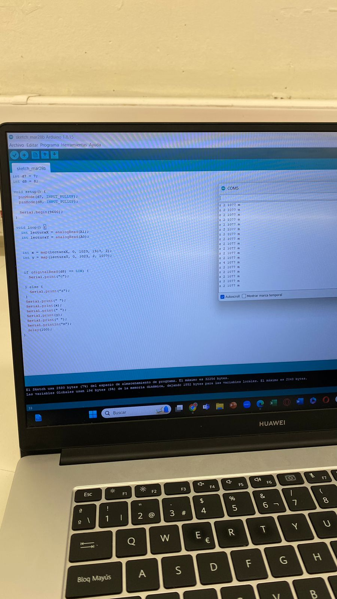

# Resolución encargo grupal clase 04.
*Jueves 28 de marzo de 2024.*

## Miembros del Grupo:
- ***Isidora Goycoolea.***
- ***Nicole Bechan.***
- ***Sebastián Millán.***

  ## [Iteración número 1 - Intento fallido](https://www.youtube.com/watch?v=0qsdvkh5eXc)
Para la realización de nuestra primera iteración de la realización del mouse con la placa Arduino R3 procedimos a utilizar la placa arduino R3 conectada a dos sensores de botones.

## [Iteración número 2 - Funcionalidad extra](https://www.hackster.io/prabeenr2/joystick-pc-mouse-18552b)
Para la realización de nuestra segunda iteración de la realización del mouse con la placa Arduino R3 procedimos a utilizar la placa arduino R3 conectada a un sensor de joystick para lograr la funcionalidad extra.

[arduinos](./c_digo_mouse.ino)

## [Iteración número 3 - Funcionalidades CORE]
Para la realización de nuestra tercera iteración de la realización del mouse con la placa Arduino UNO R3 procedimos a conectar solo un boton a la protoboard y la placa para también hacer cambios en el código con respecto a la iteración número 1. Como resultado de este ejercicio pudimos ver que logramos la funcionalidad de reconocer el click derecho, el click mantenido y también el doble click; con este último destacamos la malfuncionalidad de que al marcar un click doble, marca también al mismo tiempo un click derecho.
