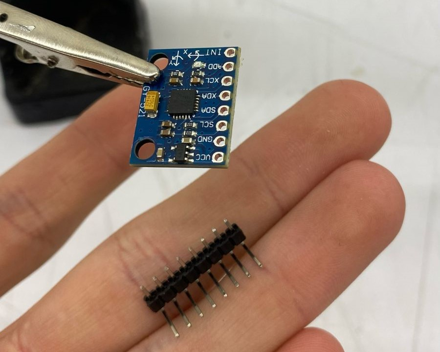
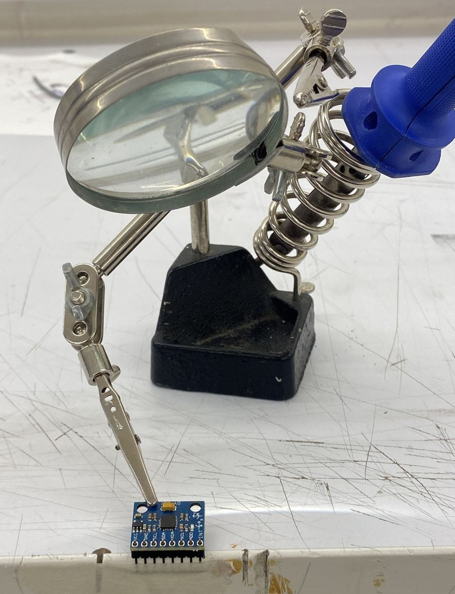
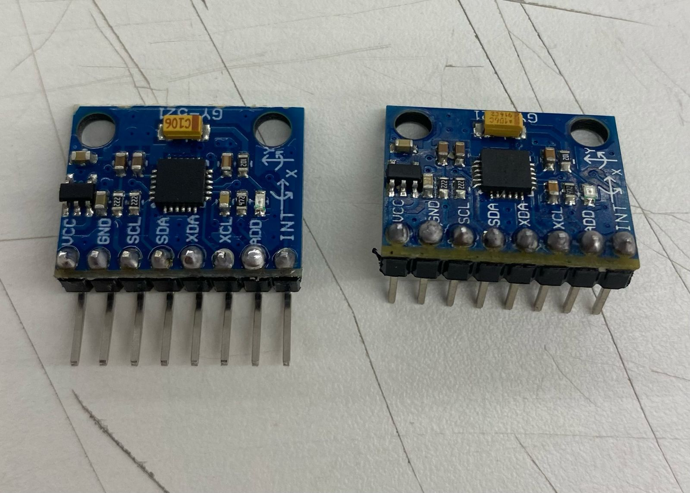

# clase-11

la clase anterior compramos los materiale necesarios para comenzar a armar el codigo 

entre estos compramos dos sensores girscopio mpu-6050 (uno por si se nos rompe alguno) los cuales nos dimos cuenta de que necesitaban ser soldados para conectarlos a la protoboard
En este caso soldamos cada conexcion con una barra para poder conectarla a la protoboard y poder desconecarla cuando querramos 
llegaron cada uno con dos tipos de extenciones diferentes, una hacia el costado y la otra recta
dado esto buscamos soldar cada una con una diferente

tratamos de que las soldaduras quedaran separadas de cada conexion

aunque logramos el objetivo nos dimos cuenta de que debiamos asegurarnos que los agujeros queden en contacto con la nueva conexion 
por lo mismo calentamos el estaño de los bordes para que caiga en los agujeros

ya teniendo los sensores soldados comenzamos a meternos en el codigo
para esto buscamos un tutorial en donde se utiliza la medida de los angulos con el giroscopio
antes de iniciar con el codigo nos piden descargar tres librerias las cuales, en la busqueda, descubrimos que eran muy antiguas igual que el tutorial escogido anteriormente

nos obligamos a buscar otro turorial 
para no caer en el mismo problema buscamos tutoriales en ingles y que tuvieran muchas vistas.

ya con esto encontramos un ejemplo con el que sabemos que no vamos a tener muchos problemas
ahora nos quedaria comenzar a testear el sensor y los codigos aumentando los artefactos que le queramos conectar 
por ejemplo partir usando solo el sensor y que el computador lea el angulo
añadirle de a poco complicaciones como puede ser encender una luz

